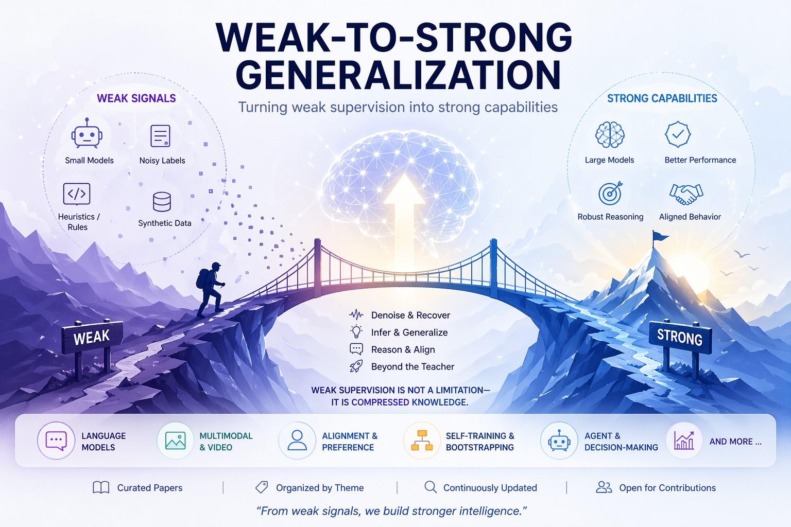

# 📚 Awesome Weak-to-Strong Generalization

A curated collection of papers, resources, and insights on **Weak-to-Strong Generalization (W2SG)** in large models.

---

## 🧠 What is Weak-to-Strong Generalization?

Weak-to-Strong Generalization studies the phenomenon where:

> A strong model trained on weak supervision can **match or even surpass** the performance of the weak source.

This paradigm appears across:

- Large Language Models (LLMs)
- Multimodal Models (VLMs, Video Models)
- Alignment & Preference Learning
- Agent-based Systems

---

## 🚀 Why It Matters

- ❌ Real-world supervision is often noisy  
- ❌ High-quality labels are expensive  
- ❌ Weak signals are cheap and scalable  

👉 W2SG provides a new scaling axis:  
**improving performance without improving supervision quality**

---

## 🗂️ Paper Taxonomy

## 📊 Representative Papers

| Paper | Venue | Setting | Weak Source | Strong Gain |
|------|------|--------|------------|------------|
| Weak-to-Strong Generalization: Eliciting Strong Capabilities with Weak Supervision | ICLR 2024 | Alignment | Weak reward model | ✔ |
| Self-Improving Language Models | ICML 2023 | Self-training | Model itself | ✔ |
| RLAIF: Learning from AI Feedback | NeurIPS 2023 | Alignment | AI feedback | ✔ |
| Direct Preference Optimization (DPO) | NeurIPS 2023 | Alignment | Weak preferences | ✔ |
| Constitutional AI | NeurIPS 2023 | Alignment | Rule-based feedback | ✔ |
| Distilling Step-by-Step Reasoning | NeurIPS 2022 | Reasoning | Weak CoT | ✔ |
| Teaching Small Models to Reason | arXiv | Reasoning | Large model CoT | ✔ |
| STaR: Bootstrapping Reasoning | NeurIPS 2022 | Self-training | Self-generated CoT | ✔ |
| Self-Consistency Improves CoT | ICLR 2023 | Reasoning | Multiple weak paths | ✔ |
| Noisy Student Training | CVPR 2020 | Vision | Noisy pseudo-labels | ✔ |
| Pseudo-Labeling for Semi-Supervised Learning | ICML | SSL | Weak labels | ✔ |
| FixMatch | NeurIPS 2020 | SSL | Augmented weak labels | ✔ |
| Knowledge Distillation | NeurIPS 2015 | Distillation | Teacher logits | ✖ |
| Born-Again Neural Networks | ICML 2018 | Distillation | Same architecture | ✔ |
| When Does Student Surpass Teacher? | ICML | Distillation | Weak teacher | ✔ |
| VideoCoCa / Flamingo-style works | NeurIPS | Multimodal | Weak alignment | ✔ |
| BLIP / BLIP-2 | ICML 2023 | Multimodal | Noisy captions | ✔ |
| LLaVA | NeurIPS 2024 | Multimodal | GPT-generated data | ✔ |
| Voyager (Minecraft Agent) | NeurIPS 2023 | Agent | Weak exploration | ✔ |
| ReAct | ICLR 2023 | Agent | Prompted reasoning | ✔ |
| Reflexion | NeurIPS 2023 | Agent | Self-feedback | ✔ |

We organize the literature into the following categories:

---

### 1. 🔹 Weak-to-Strong Alignment

- Learning from weak preference signals  
- Reward modeling with imperfect annotators  
- DPO / RLHF under weak supervision  

---

### 2. 🔹 Self-Training & Bootstrapping

- Pseudo-labeling  
- Iterative self-improvement  
- Teacher-student refinement loops  

---

### 3. 🔹 Distillation Beyond Teacher

- When student > teacher  
- Capacity vs supervision mismatch  
- Knowledge reconstruction  

---

### 4. 🔹 Weak CoT → Strong Reasoning

- Learning reasoning from weak CoT  
- Implicit reasoning recovery  
- Latent structure induction  

---

### 5. 🔹 Multimodal Weak Supervision

- Weak labels for video understanding  
- Noisy grounding signals  
- Cross-modal alignment  

---

### 6. 🔹 Agent & Decision-Making

- Weak planners → strong policies  
- Learning from suboptimal trajectories  
- Preference learning in interactive systems  

---

## 📄 Paper List

### ⭐ Key Papers

- Weak-to-Strong Generalization: Eliciting Strong Capabilities with Weak Supervision  
- Self-Improving Language Models  
- Distilling Step-by-Step Reasoning  
- RLAIF / DPO related works  

---

### 📚 Full Collection

> (持续更新，欢迎 PR)

#### 2025
- [ ] Paper A  
- [ ] Paper B  

#### 2024
- [ ] Paper C  
- [ ] Paper D  

---

## 🧩 Key Insights

- Strong models rely on pretrained priors  
- Weak supervision contains partial structure  
- Iterative refinement is critical  
- Overfitting to weak signals is a major failure mode  

---

## 📊 Open Problems

- ❗ When does weak-to-strong fail?  
- ❗ How to measure beyond-teacher generalization?  
- ❗ Robustness under biased weak signals  
- ❗ Scaling laws for weak supervision  

---

## 🛠️ Related Resources

- Benchmarks  
- Codebases  
- Datasets  

---

## 🤝 Contributing

We welcome:

- 📄 New papers  
- 🧩 Taxonomy improvements  
- 📊 Benchmarks / repos  

Please submit a PR!

---

## ⭐ Star History

If you find this repo useful, consider giving it a star ⭐

---

## 📜 License

MIT

---

## 🔥 Maintainer

- Haonan Zhang

---

## 💡 Philosophy

> Weak supervision is not just noisy—it is **compressed knowledge**.
